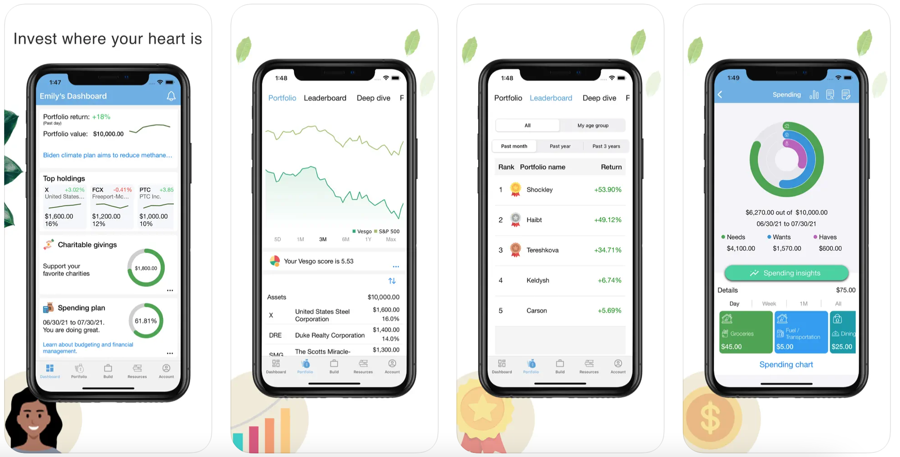
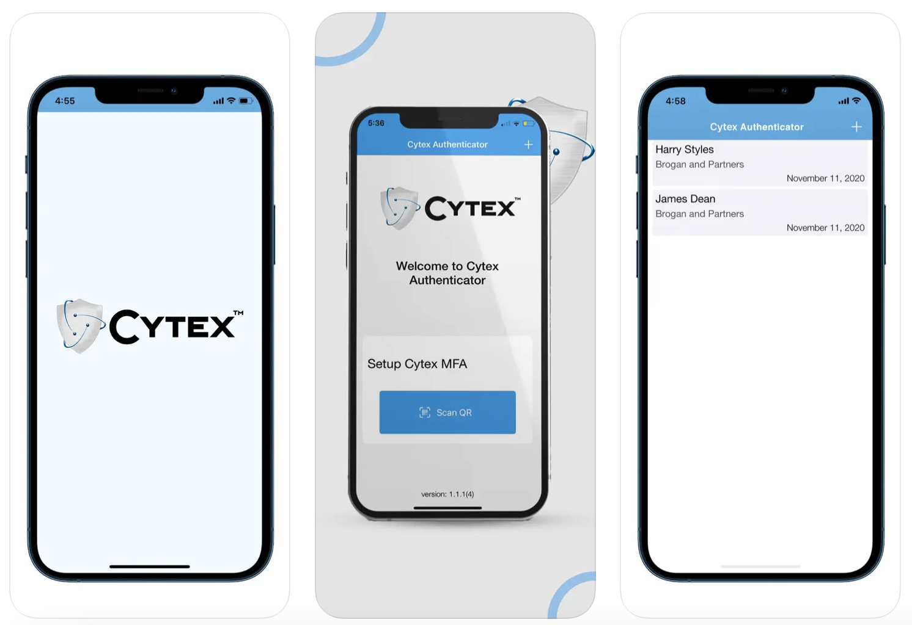
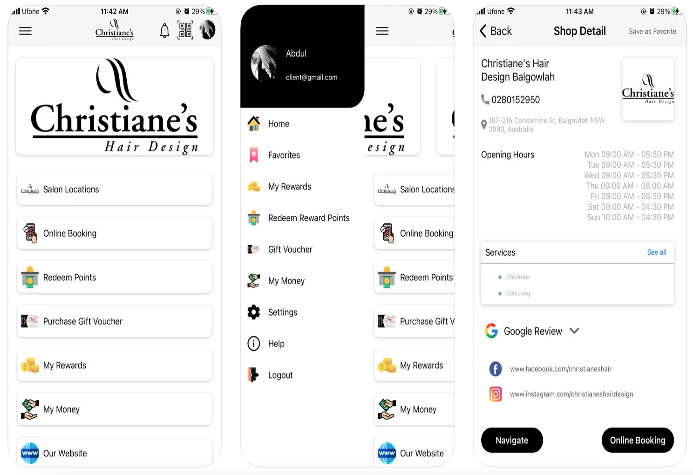

# iOS-Developer-Portfolio

         
 
### 👋 Hi! I'm a self-taught freelance/indie iOS Developer. Here's a bit of what I've been working on.

# [CloakedPrivacy](https://apps.apple.com/us/app/cloakedprivacy/id1661832241)

Protecting your digital life is of paramount importance. A comprehensive personal cybersecurity app, CloakedPrivacy, has been designed to shield your privacy, secure your data, and safeguard your digital identity.

- ⏲️ Timers
- ⚙︎ VPN Configuration
- 💵 In App Purchase
- 💿 Core Data
- 🏦 App Storage
- 💰 IAP
- ⏱️ Queue Times API
- 🎬 Animations
- 🔹 Provide information about identity theft and fraud and also guide users on how to stay safe from them.
- 📲 Incorporated tap gestures to improve the app experience
  

# [Vesgo](https://apps.apple.com/us/app/vesgo/id1523259331)

In this app, user can build personalized portfolios that aligned with their values, investment time horizon, and risk tolerance. The app provides new about investment ideas and track user goals.  

- ⏲️ Timers
- ⚙︎ Graphs
- 💿 Core Data
- 🏦 App Storage
- 💰 IAP
- 🎬 Animations
- 📲 Incorporated tap gestures to improve the app experience

# [Cytex Authenticator](https://apps.apple.com/us/app/cytex-authenticator/id1538584126)

Cytex Aythenticator provides robuts multi-factor authentication for registered user, essential for enterprise IT security. Cytex Secure, using Wiregurad, facilitates secure peer-to-peer connections, while Cytex2FA manages identity within the Zero Trust Network Architecture.

- ⚙︎ VPN Configuration
- ⇄ MFA (Multi Factor Authentication)
- ⇄ ZTNA (Zero Trust Network Architecture)
- 💿 Core Data
- 🎬 Animations
- 📲 Incorporated tap gestures to improve the app experience
  

# [My Parsl](https://apps.apple.com/pk/app/my-parsl/id1558433040)

Celebrate special events with PARSL's immersive AR lenses and avatars, adding fun and excitement to your gatherings. Enhance your social experience by inviting friends to enjou interactive AR effects together, making every occasion joyful and memorable.

- ⚙︎ AR kit
- 💿 Core Data
- 🎬 Animations
- 📲 Incorporated tap gestures to improve the app experience
  

# [Christiane's Hair Design](https://apps.apple.com/pk/app/christianes-hair-design/id1579004647)

This app allows you to book hair and beard services at our global salon branches worldwide. Enjoy the convenience of scheduling appointments and receiving discount coupons through the app.

- 💿 Core Data
- 🏦 App Storage
- 💰 IAP
- ⏱️ Queue Times API
- 🎬 Animations
- 🔹 Provide information about identity theft and fraud and also guide users on how to stay safe from them.
- 📲 Incorporated tap gestures to improve the app experience
