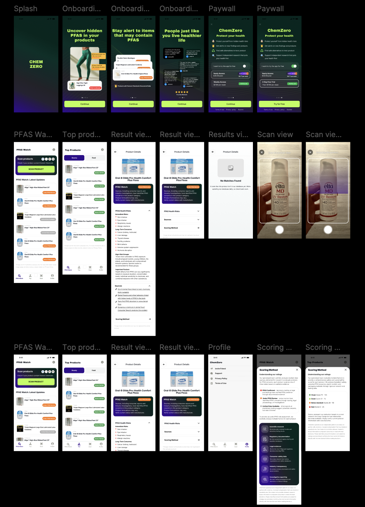
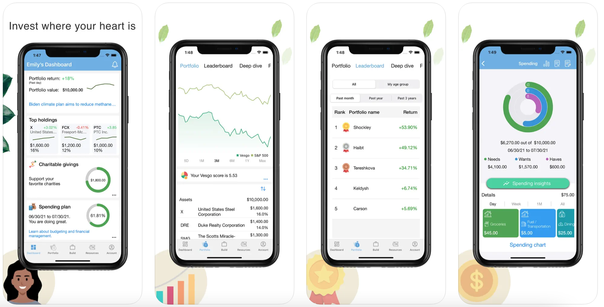
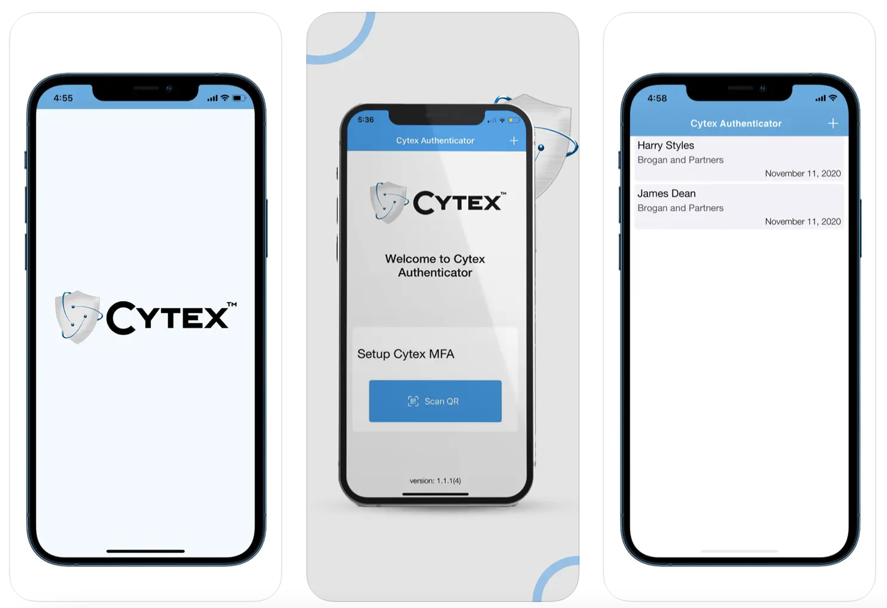
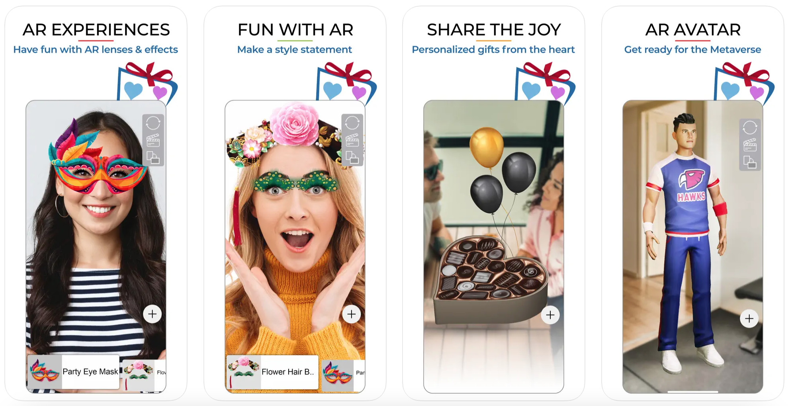
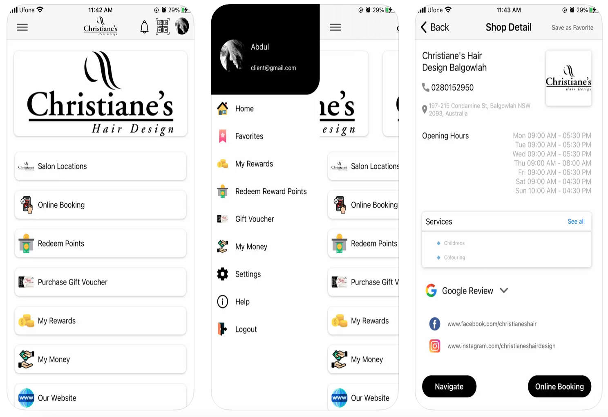

# Senior iOS-Developer-Portfolio

         
 
### 👋 Lead iOS Developer with expertise in Swift, SwiftUI Objective-C, and scalable architecture to deliver high- performance mobile applications. Proven ability to optimize app performance, implement secure authentication, and enhance user engagement through best coding practices and cross-functional collaboration. Focused on driving innovation and quality to achieve impactful product growth and superior user experiences.

# [Aura: English HD](https://apps.apple.com/au/app/aura-english-hd/id1527934446)

Aura is a revolutionary English-learning platform that teaches American pronunciation using a color-based sound system (English HD). By mapping each sound to a specific color, Aura simplifies pronunciation learning, supports multilingual word translation, and offers flashcards, video lessons, and a comprehensive 12-day master course.

# [HomeFresh](https://apps.apple.com/us/app/homefresh/id6746563748)

Architected a scalable, dual-sided marketplace connecting users with certified local home
kitchens.
Customer App: Enabled seamless discovery, ordering, and payment for high-quality, home-cooked meals.
Provider App: Delivered a unified platform for kitchens to manage menus, process orders, display reviews, and automate payments.

# [TrackHero](https://apps.apple.com/my/app/trackhero-team/id6474099873)

TrackHero is a powerful, web-based event management platform built for flexibility and ease of use. Plan and manage events effortlessly, whether you're in the office or on the go. Streamline reservations, payments, and customer tracking from a single dashboard. Stay organized with integrated task management and real-time updates. Gain insights and control with a centralized, intuitive interface. Perfect for teams who need efficiency, mobility, and scalability in one solution.

# [ChemZero](https://apps.apple.com/my/app/chemzero-pfas-checker/id6739990764)

In this app we empower app users by encouraging the use of clean, sustainable products that are safe for their health and the environment. Our platform provides detailed insights into product ingredients, ensuring transparency and informed choices. By promoting eco-friendly and non-toxic alternatives, we help users adopt a healthier and more conscious lifestyle. Together, we strive to create a positive impact on personal well-being and the planet.

- 📝 Advanced Text Scanning Technology
- 🤖 AI-Powered Text Recognition & Chat
- 🔥 Seamless Firebase Integration
- 🔐 Secure KyeChain Authentication
- 💾 Efficient Local Database Management
- 🛒 Integrated In-App Purchase System

# [CloakedPrivacy](https://apps.apple.com/us/app/cloakedprivacy/id1661832241)

Protecting your digital life is of paramount importance. A comprehensive personal cybersecurity app, CloakedPrivacy, has been designed to shield your privacy, secure your data, and safeguard your digital identity.

- ⏲️ Timers
- ⚙︎ VPN Configuration
- 💵 In App Purchase
- 💿 Core Data
- 🏦 App Storage
- 💰 IAP
- ⏱️ Queue Times API
- 🎬 Animations
- 🔹 Provide information about identity theft and fraud and also guide users on how to stay safe from them.
- 📲 Incorporated tap gestures to improve the app experience
  

# [Vesgo](https://apps.apple.com/us/app/vesgo/id1523259331)

In this app, user can build personalized portfolios that aligned with their values, investment time horizon, and risk tolerance. The app provides new about investment ideas and track user goals.  

- ⏲️ Timers
- ⚙︎ Graphs
- 💿 Core Data
- 🏦 App Storage
- 💰 IAP
- 🎬 Animations
- 📲 Incorporated tap gestures to improve the app experience

# [Cytex Authenticator](https://apps.apple.com/us/app/cytex-authenticator/id1538584126)

Cytex Aythenticator provides robuts multi-factor authentication for registered user, essential for enterprise IT security. Cytex Secure, using Wiregurad, facilitates secure peer-to-peer connections, while Cytex2FA manages identity within the Zero Trust Network Architecture.

- ⚙︎ VPN Configuration
- ⇄ MFA (Multi Factor Authentication)
- ⇄ ZTNA (Zero Trust Network Architecture)
- 💿 Core Data
- 🎬 Animations
- 📲 Incorporated tap gestures to improve the app experience
  

# [My Parsl](https://apps.apple.com/pk/app/my-parsl/id1558433040)

Celebrate special events with PARSL's immersive AR lenses and avatars, adding fun and excitement to your gatherings. Enhance your social experience by inviting friends to enjou interactive AR effects together, making every occasion joyful and memorable.

- ⚙︎ AR kit
- 💿 Core Data
- 🎬 Animations
- 📲 Incorporated tap gestures to improve the app experience
  

# [Christiane's Hair Design](https://apps.apple.com/pk/app/christianes-hair-design/id1579004647)

This app allows you to book hair and beard services at our global salon branches worldwide. Enjoy the convenience of scheduling appointments and receiving discount coupons through the app.

- 💿 Core Data
- 🏦 App Storage
- 💰 IAP
- ⏱️ Queue Times API
- 🎬 Animations
- 🔹 Provide information about identity theft and fraud and also guide users on how to stay safe from them.
- 📲 Incorporated tap gestures to improve the app experience

# [Chance](Project )

Login & Registration: An intuitive login screen with options for users to register by creating a username, password, display name, and group, with customizable privacy settings.
Feed & Notifications: The feed is designed like a Twitter timeline with filters for types of bets, live vs pre-game, and a trending/following toggle for easy navigation.
Groups & Communication: Group creation allows users to set messaging permissions and invite members, with profanity filter settings that ban hate speech.
Bet Management: Users can easily manage bets with detailed slips including sports, odds, markets, risk, and profit, all with clear visual feedback.
Profile & Analytics: Comprehensive profile pages display bet performance through customizable filters, real-time analysis, and detailed profit/loss stats, aiding strategic decisions.

- 💿 Firebase
- 💿 SwiftUI
- 🏦 App Storage
- ⏱️ Queue Times API
- 🎬 Animations
- 🔹 Provide information about Change.
- 📲 Incorporated tap gestures to improve the app experience
